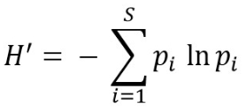
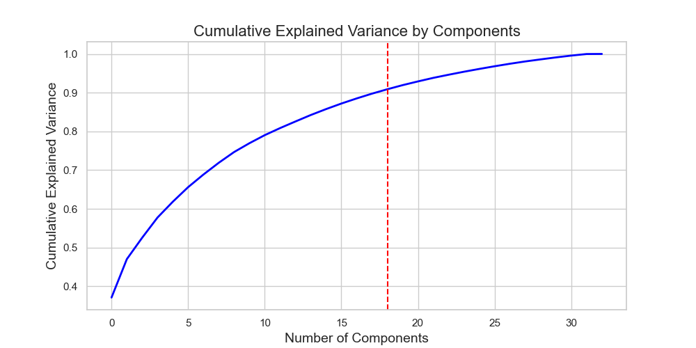
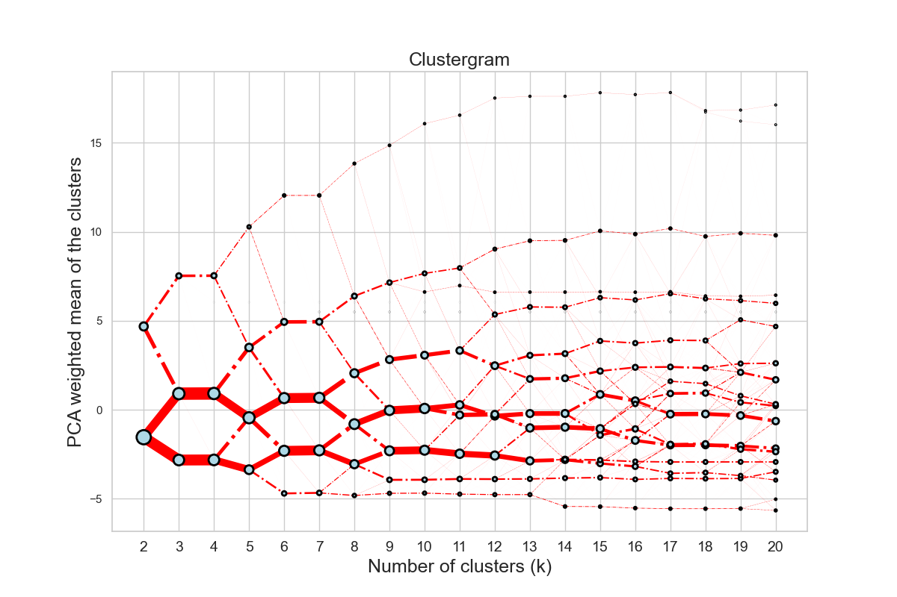
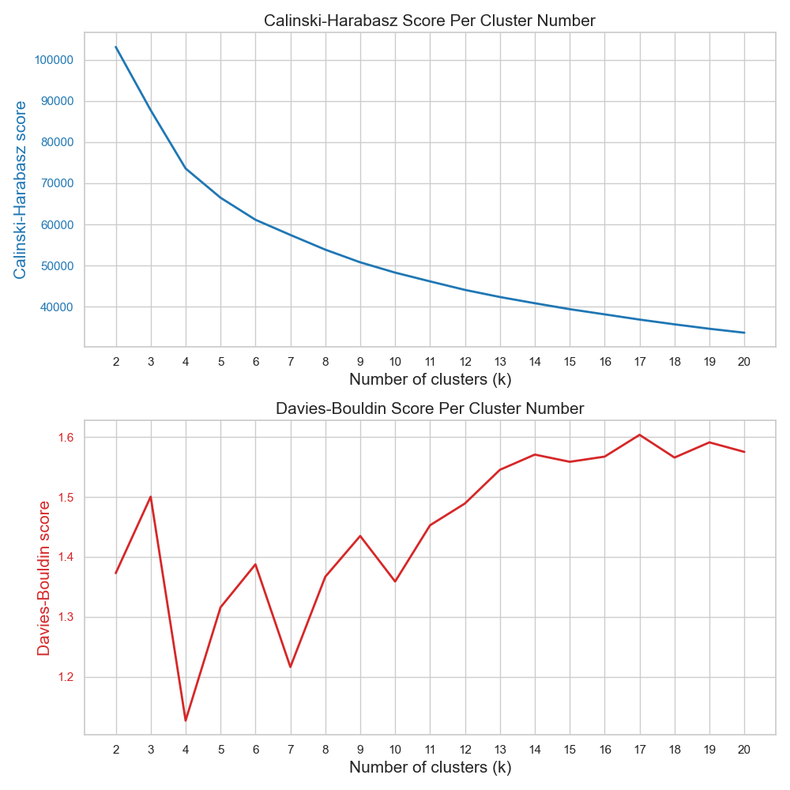
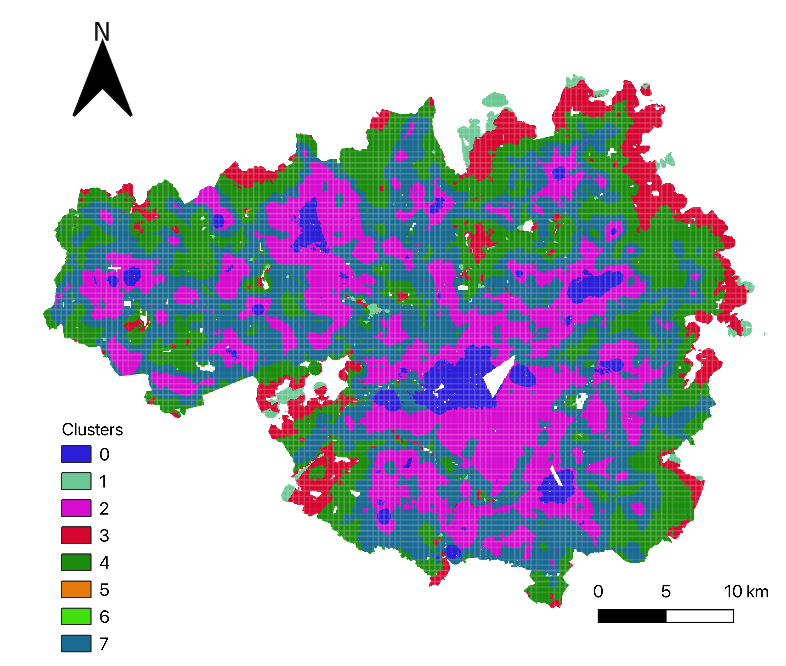
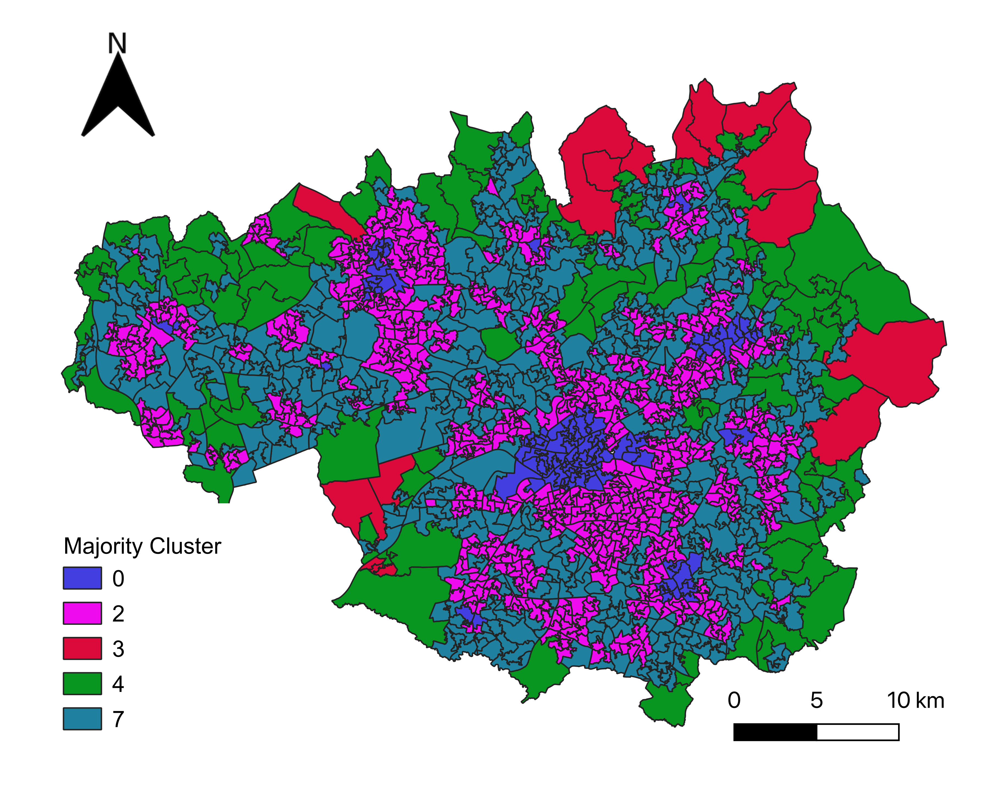
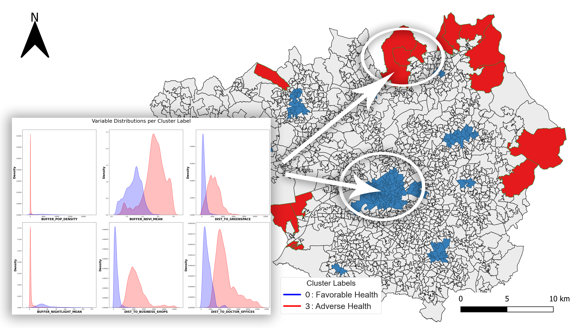

# MultiHealth: multi-dimensional urban and environmental exposures and inequality for mental health.

# Aims and objectives
Research regarding the effect of urban and environmental exposures on health outcomes is mostly done in high-income countries because of the abundance of available data. This project was created to make this kind of research more accessible for low- to middle income countries and to assess the relationship between the environment and mental health. In this project, the first aim was to form a reproducible method for the creation small-scale, multi-dimensional urban and environmental spatial indicators that is applicable to mental health research in low- to middle income countries, by leveraging open-source methods. The second objective was to assess the spatial heterogeneity of the urban and environmental spatial indicators by means of K-means cluster modeling. Lastly, the last objective was to assess the relationship between the small-scale spatial indicators and mental health. This was performed using various statistical and visual analyses.

# Table of Contents
- [Environment setup](#environment-setup)
  - [Using a local environment](#using-a-local-environment)
  - [Using Google Colab](#using-Google-Colab)
- [Workflow elaboration](#workflow-elaboration)
  - [Data collection](#data-collection)
  - [Data modeling](#data-modeling)
- [Acknowledgements and Contact Information](#acknowledgements-and-contact-information)
 
## Environment setup

### Using a local environment
When running the project in a local environment, make sure you:

<ol>
  <li>Download the following environment YAML, ipynb and health dataset files:
    <ul>
      <li>'multihealth-env.yml'</li>
      <li>'gridcreation.ipynb'</li>
      <li>'distancedensitydiversity_calculation.ipynb'</li>
      <li>'healthenvironment_relation.ipynb'</li>
      <li>'Greater_Manchester_NH_GIS.gpkg'</li>
      And from the 'country_iso_files' directory:
      <li>'iso_countries.xlsx'</li>
      <li>'cities.xlsx'</li> 
    </ul> 
  <li>Create an empty working directory to put them in</li>  
  <li>Then, open a command prompt or a mac terminal, navigate to the working directory by executing this command:
  
  ```
  cd path/to/working/directory
  ```
 
  and install the conda environment by executing the following command:
  
  ```
  conda env create -f multihealth-env.yml
  ```
 
  </li>
  <li>Then, activate the newly created conda environment by executing the following command: 
  
  ```
  conda activate multihealth-env
  ```

  </li>
  <li>Alternatively, if you are not a fan of conda and know how to work with a local Python virtual environment, you can use the requirements.txt file from the repository for the installation of the required packages. So, activate your virtual environment and put the requirements.txt file in the working directory. Then, open a command prompt or a mac terminal, navigate to the working directory and install the required packages from the text file by executing this command:
  
  ```
  pip install -r requirements.txt
  ```

  </li>
</ol>

### Using Google Colab
When running the project in Google Colab, make sure you:

<ol>
  <li>Download the same files as listed above</li>
  <li>Upload them to the default '/content' folder to make sure the path that is created in the notebook is still functional</li>
  <li>Install the following packages before importing the listed packages in the notebooks:
    
  ```python  
  %pip install osmnx
  %pip install geemap
  %pip install rasterstats
  %pip install libpysal
  %pip install rioxarray
  %pip install pylandtemp
  %pip install mapclassify
  %pip install esda
  %pip install clustergram
  %pip install scikit-posthocs 
  ```

  </li>
</ol>

## Workflow elaboration

<br><br>

### Data collection
The gridcreation.ipynb and distancedensitydiversity_calculation.ipynb notebooks are used for this part and starts with gridcreation.ipynb.
<ol>
  <li><b>Selecting the urban area of interest</b></li>
This study focused on the Greater Manchester city-region in the United Kingdom, chosen for its comprehensive environmental and health-related data. Greater Manchester offers a unique case study due to its diverse landscape, including flat plains, hills, various urban green spaces, and numerous rural-to-urban transition zones. With a population of 2.8 million people spread over 1276 km<sup>2</sup>, it provides an opportunity to evaluate the effects of both urban and natural environments on mental health. The city-region is also notable for its range of social deprivation characteristics, with extremes observable at both ends of the spectrum. These characteristics have been associated with a variety of illnesses and disabilities, further emphasizing the relevance of Greater Manchester as a case study for exploring the relationship between environment and mental health. In the context of data scarcity and the link between environment and mental health in low- and middle-income countries (LMICs), the lessons learned from high-income countries like the UK can be invaluable. The findings and methodologies from this study can be adapted and applied to LMICs, making Greater Manchester a particularly suitable case study.
  <br><br>
  
  <li><b>Obtaining the health geodataframe</b></li>
Mental health data for this study was sourced from the UK’s Place-based Longitudinal Data Resource (PLDR). This dataset covers the Greater Manchester neighborhoods, with a particular focus on the Lower Layer Super Output Areas (LSOAs). LSOAs are designed to maintain a consistent population size of around 1500 residents or 650 households. Out of 32,844 LSOAs in England, 1,673 are located in Greater Manchester. The dataset provides information on mental health, specifically depression prevalence and the rate of antidepressant use. The mental health dataset was used to provide context and potentially corroborate the assessment of the relationships between the environment and mental health.
  <br><br>
  
  <li><b>Extracting the raster population and remote sensing data using GEE</b></li>
The collection of a country's population data is performed using the Google Earth Engine (GEE) API. This is done by identifying the country based on its ISO code. Once the country's population data is obtained, the data is further refined by clipping it with the city's specific area geometries, which are derived from OpenStreetMap (OSM). This allows the focus on the population data specific to the urban area of interest, Greater Manchester. For the NDVI, LST, DEM, and Night Light data, the process is similar. However, instead of starting with a specific country, these data are collected globally from GEE. Then, this global data is clipped with the country boundaries using the country's Global Administrative Unit Layers (GAUL) code. This gives country-specific data for these variables. To further refine the data, it is clipped again using the city's OSM area geometries, resulting in city-specific data for each of these variables. All the extracted and processed data are subsequently saved in a folder named 'GEE_city_grids', which is created at the start of the notebook. This ensures that all the data are organized and easily accessible for further analysis.
  <br><br>
  
  <li><b>Creating the population grid of the urban area of interest</b></li>
In this step of the workflow, the process is initialized by opening the extracted population TIFF file located in the created ‘GEE_city_grids’. This file contains the population data, which is then transformed into a pandas dataframe, with each row representing a pixel. Following this, polygons are generated from these pixels which are subsequently used to create a geodataframe. This geodataframe is then intersected with the city's area to ensure that the focus is on the relevant geographical region. To further refine the data, the initial grid is dissolved into larger grid cells, each of which encompasses a specific population. Finally, the coordinates are calculated for these larger grid cells, providing a spatially accurate and detailed representation of the population distribution within the urban area of interest.
  <br><br>
  
  <li><b>Creating the variables from the raster files</b></li>
Besides the creation of a population grid using the population TIFF file, the extracted TIFF files are additionally used to form variables for the population grid. For each of the grid cells, buffer zones are created with a radius of 500 meters. Then, the ‘rasterstats’ package is used to compute the intersected pixels from the extracted TIFF files with each of the grid cell buffer zones. Subsequently, it calculates the total population, average NDVI, average LST, average DEM and average Night Light values, for each of the grid cell buffer zones. Lastly, the population density in km<sup>2</sup> for each grid cell buffer zone is calculated by dividing the total population by the surface area of the buffer zone. 
  <br><br>
The figure below shows the Greater Manchester area with on the left the plotted population values for the grid cells and on the right the average NDVI values. You can observe the contrast between densely populated areas and densely vegetated areas.
  <br><br>
  <p float="left">
    
     
  </p>
  
  <li><b>Extracting OSM street networks</b></li>
The street networks are extracted for the entire urban area of Greater Manchester on a per-grid basis. The entire street network of the city is obtained from OpenStreetMap using OSMnx's ‘graph_from_place’ function and then projected to a specified CRS with units in meters. This street network is represented as a graph. After obtaining the entire city's street network, the code then identifies subgraphs for each grid cell using NetworkX’s ‘subgraph’ function applied to the entire street network. This is accomplished by finding the nodes of the city-wide network that intersect with each grid cell buffer and extracting the subgraph from the entire network based on these intersecting nodes. A subgraph essentially represents the street network within each grid cell buffer. Next, the code calculates the area of these street networks in each grid cell buffer, which is needed for the density statistics of the street networks that are going to be calculated in the next step. The subgraph is transformed into a geodataframe, and then this geodataframe is converted into one large polygon. The area of this polygon represents the street network area within each grid cell buffer.
  <br><br>
  
  <li><b>Computing the street network statistics variables</b></li>
In order to compute the statistics of the extracted street networks for each of the grid cell buffer zones, OSMnx’s ‘stats.basic_stats’ function is applied to each of the street networks. As mentioned, the calculated areas of the street networks are supplied to provide additional density statistics. These street network statistics encompass variables such as the number and the density of (three-way) intersections and the total and density of the street length.
  <br><br>
  
  <li><b>Extracting points of interest using OSM</b></li>
Now using the distancedensitydiversity_calculation.ipynb notebook, the points of interest covered a range of built and environmental variables spanning the following categories; density, diversity, environmental, distance to public transport, and destination accessibility. The variables were extracted from OpenStreetMap utilizing the OSMnx package's 'geometries_from_place' function. This function allows for the features defined in the tags to be extracted from a specific area.
  <br><br>
  
  <li><b>Computing the shortest distance to the extracted points of interest and computing the building density and land diversity</b></li>
For the computation of the shortest distance to the extracted points of interest, the street network of the respective urban area is required. Like the previous notebook, this data can be extracted from OpenStreetMap (OSM). The street network is used for computing the shortest distance from the nearest node of each grid centroid within a threshold of 1000 meters. Then, the code identifies the nearest node for each point of interest, extracted in the previous step, for each grid. Additionally, the code computes the building density per grid cell, this is done by intersecting the building data with the previously created buffer polygons and counting the number of buildings within that area. The building density is then calculated by dividing the number of buildings by the area of the buffer polygon in meters. The building density is then converted to km<sup>2</sup> by multiplying the values by 1,000,000. Moreover, the land use diversity for each grid cell is computed by calculating the frequency of each land use category within each grid and computing the Shannon diversity score based on these frequencies. 
  <br><br>
The Shannon Diversity Index formula is as follows: 
  <br><br>
  
  <br><br>
where 𝑝𝑖 is the proportion of the 𝑖-th land-use type within the buffer.
  <br><br>
  
 <li><b>Data harmonization</b></li>
The data harmonization encompasses all the steps within the data collection phase by analyzing if all variables are present in the final dataframe. This is ensured by joining each newly computed variable to the existent ‘popgrid’ dataframe, with each step forming as a building block to creating a complete overview of the built and natural environment of the urban area.
</ol>

### Data modeling
The healthenvironment_relation.ipynb notebook is used for this part.
<ol>
  <li><b>Data pre-processing</b></li>
In this stage of the process, the workflow is initiated by importing the two crucial geodataframes: one containing the grid data and the other containing the mental health-related information. Then, isolate the grid variables that are selected for the clustering process, excluding any geometry columns as they are not suitable for this analysis. To maintain the integrity of the data, missing and infinite values that could distort the findings are removed. Subsequently, the cluster variables are standardized by scaling the variables to unit-variance to ensure they are on a comparable scale, which is essential for accurate analysis. These standardized variables are then transformed into a dataframe for the upcoming Principal Component Analysis (PCA). Additionally, to assess the extent to which the variables are spatially dependent, the Moran’s I value is calculated for each of the variables by using a spatial weight matrix with queen’s contiguity. Lastly, a PCA is conducted to compensate for the presence of multicollinearity within the cluster variables. First, a correlation analysis is conducted to identify potential multicollinearity among our variables. Next, a PCA is implemented, setting the number of principal components equal to the number of cluster variables. Then, the cumulative variance explained by these components is calculated to determine the number of components needed to retain 90% of the initial data variance. Further, the PCA model is constructed, specifying 90% data variance retention, and applied to the standardized cluster variables. Lastly, the factor loadings for each principal component are printed to assess whether the principal components are reasonable regarding the variables.
  <br><br>
The figure below visualizes the cumulative explained variance across the principal component numbers with a red vertical line at the 90% variance mark, from this study.
  <br><br>
  
  <br><br>
  
  <li><b>Clustering analyses</b></li>
For the clustering analysis, k-means clustering is performed on the dataset that has been transformed using PCA. The code begins by initializing the clustergram object. The range of clusters and the number of centroid initializations are hyperparameters and they are set from 2 to 20 and to 25, respectively, in the current case study of Greater Manchester. A large number of cluster models is trained due to the large number of spatial features and the complexity of the health relationship while 25 centroid initializations assisted the cluster assignment convergence and the minimization of the WCSS score. After the initialization, the Clustergram object is fitted to the PCA-transformed data. Following the model fitting, a clustergram is plotted. The y-axis of the clustergram shows the weighted mean of the clusters after applying PCA, this allows for visual identification of an optimal number of clusters, typically where the lines start to plateau, indicating a diminishing return on adding more clusters.
  <br><br>
  Below is a figure of the clustergram from this study.
  <br><br>
  
  <br><br>
  
  <li><b>Sensitivity analyses</b></li>
In the sensitivity analyses, the performance of the k-means clusters created in the previous step is analyzed. This is conducted using the Caliński-Harabasz and Davies-Bouldin scores, two commonly used metrics to evaluate the goodness of fit for a clustering model. The CH score measures the ratio of between-cluster variance to within-cluster variance, with higher scores indicating better clustering and thus emphasizes the compactness of the clusters. On the other hand, the DB score measures the average similarity of each cluster with its most similar counterpart and thus emphasizes the between-cluster separation. In this case, clusters that are more distinct and less dispersed yield a lower (and thus better) DB score.
  <br><br>
  Below is a figure that visualizes the performance metrics from this study.
  <br><br>
  
  <br><br>
  
  <li><b>Merging cluster results with mental health data</b></li>
After the clustering, the results are merged with the mental health dataset, allowing for the examination of the relationship between the clusters and mental health, specifically focusing on depression. Firstly, the population grid geodataframe is subsetted to only include the relevant cluster labels and geometries. Similarly, the health dataset is subsetted to include only the necessary mental health variables such as the estimated prevalence of depression, the daily rate of antidepressant use, and the corresponding LSOA geometries. The columns are then renamed for clarity. Next, a spatial join operation is performed between the two datasets. Rows from the population grid and mental health datasets that share the same geographical location (based on the 'intersects' predicate) are merged. Subsequently, for each area (represented by a unique ID), the most common cluster label is calculated. This is achieved by applying the mode function to the column that contains the cluster labels, grouped by the unique ID. A measure of the diversity of the clusters within each area is also taken using Shannon's Diversity Index. In this context, the index quantifies the diversity of cluster labels within each area, with a higher value indicating more diversity. Finally, the majority cluster and the cluster diversity geodataframes are merged with the mental health geodataframe, based on the unique ID. The resulting geodataframe provides geometries of each LSOA, its associated mental health metrics, the majority cluster label, and the diversity of the clusters.
  <br><br>
  Below is a figure of the cluster map on the left from the population grid geodataframe, and the majority cluster map from the mental health LSOA geodataframe on the right.
  <br><br>
  <p float="left">
  
  
  </p>
  
  <li><b>Statistical and visual analyses of the environment-mental health relationship</b></li>
In this last stage, a combination of contingency tables, spatial plots, and histograms are employed to assess the spatial heterogeneity and distributions of the depression variables. Contingency tables are employed to determine the frequency of Lower Layer Super Output Areas (LSOAs) within each majority cluster. Then, boxplot distributions of depression variables across the majority clusters are generated and Kruskal-Wallis and Dunn's tests are applied to these distributions to identify significant differences in these distributions. The objective is to detect a pattern or sequence from clusters that are favorable to those adverse for mental health. To assess the strength of the relationship between the order of the majority clusters and mental health, the 'Majority cluster' variable is converted into two Likert scales and are subsequently correlated with the depression variables. This two Likert scale approach is due to different orders of the majority clusters between the two mental health variables in this case study. Next, the density distributions of the cluster variables for the clusters that are most favorable and most adverse for mental health are analyzed. This enabled inferences about the environmental variables within these clusters to determine specific environment variable variations related to mental health variations. Lastly, the general density distributions of all cluster variables are plotted and a summary of their descriptive statistics is provided.
  <br><br>
Below is a figure that visualizes the density distributions of the environment variables in the clusters from this case study that showed the most favorable (cluster 0) and adverse (cluster 3) mental healt outcomes. 
  <br><br>
    
</ol>

## Acknowledgements and Contact Information
This is a project made in collaboration with Dr. S.M. Labib from the Department of Human Geography and Spatial Planning at Utrecht University. This is a project of the Spatial Data Science and Geo-AI Lab, conducted for the Applied Data Science MSc degree.

| Name        | Email                       |
|-------------|-----------------------------|
| J. Esselink | j.esselink@students.uu.nl |
| S.M. Labib  | s.m.labib@uu.nl             |


